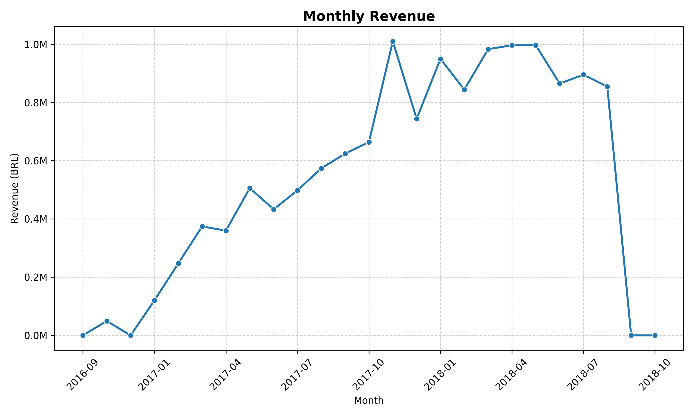
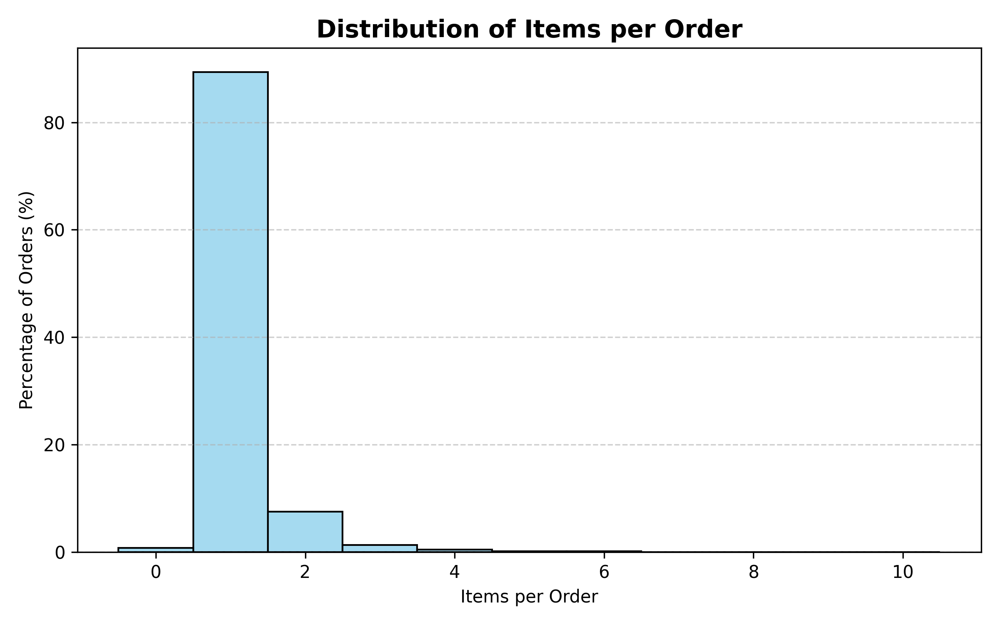
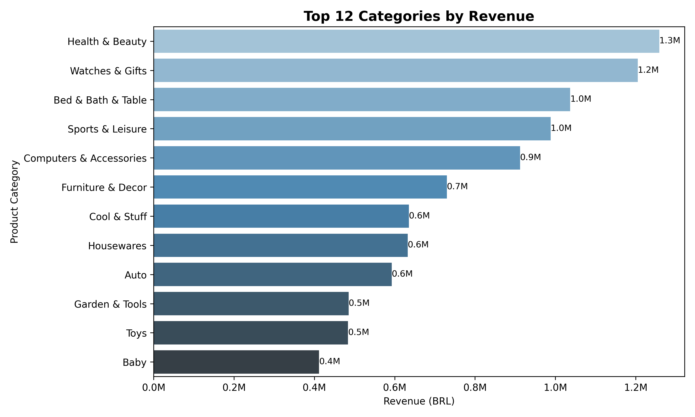
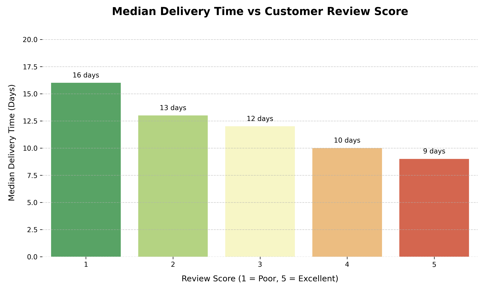

# Task 9: Business Insights & Executive Report for E-Commerce Dataset
### Internship Project – Elevvo

This project performs a **full-cycle analysis** on the Brazilian **Olist E-Commerce Dataset**, focusing on sales trends, product performance, and customer segmentation.  
The goal is to generate actionable business insights and present them in a professional, portfolio-ready format.

---

## 📂 Dataset
- Source: [Brazilian E-Commerce Public Dataset by Olist](https://www.kaggle.com/datasets/olistbr/brazilian-ecommerce)  
- Contains real e-commerce transactions: orders, items, products, payments, reviews, and customer information.

---

## 🛠️ Tools & Libraries
- Python  
- Pandas, NumPy  
- Matplotlib, Seaborn  
- Scikit-learn  
- Jupyter Notebook  

---

## 🔎 Workflow / Steps
1. **Data Loading** – Load all relevant datasets (orders, items, customers, products, payments, reviews)  
2. **Data Cleaning & Preprocessing** – Handle missing values, convert timestamps, merge data  
3. **Feature Engineering** – Create metrics like delivery time, monthly revenue, and average order value  
4. **Exploratory Data Analysis (EDA)** – Analyze revenue trends, order sizes, top product categories, delivery performance  
5. **Customer Segmentation** – Apply RFM scoring and KMeans clustering to identify Top, Loyal, and At-Risk customers  
6. **Visualizations with Insights** – Key plots with mini takeaways for business decisions  
7. **Key Insights & Conclusion** – Summary of actionable metrics and recommendations  

---

## 📊 Key Insights
- **Revenue Trend:** Steady growth over time with Q4 seasonal peaks  
- **Top Categories:** Health & Beauty, Watches & Gifts, and Bed, Bath & Table generate the highest revenue  
- **Order Behavior:** Most orders contain 1–3 items; average order value ≈ BRL 160  
- **Delivery Performance:** Median delivery time ≈ 10 days; faster deliveries correlate with higher review scores  
- **Customer Segments:** Three clusters identified — Top, Loyal, At-Risk  
- **Retention Opportunities:** Targeting at-risk customers and improving delivery speed can boost repeat purchases  

---

## 📈 Visualizations & Mini Insights

### Monthly Revenue Trend
  
*Revenue grows steadily over time with seasonal peaks in Q4, indicating strong holiday sales.*

### Items per Order Distribution
  
*Most orders contain 1–3 items, highlighting typical purchase size.*

### Top 12 Product Categories by Revenue
  
*Health & Beauty, Watches & Gifts, and Electronics dominate revenue — focus areas for marketing and inventory.*

### Median Delivery Time vs Review Score
  
*Faster deliveries generally receive higher customer review scores, showing the importance of logistics.*

---

## ▶️ How to Run
- Install dependencies: `pip install -r requirements.txt`  
- Open the notebook: `jupyter notebook Olist_Analysis.ipynb`
  To run the notebook locally:
    1. Download all CSV files from the Kaggle dataset.
    2. Create a folder named `data/` in the root directory of this project.
    3. Place all CSVs inside `data/` (e.g., `data/olist_orders_dataset.csv`, etc.)  
- All plots are saved in the `images/` folder and referenced in this README  
- Executive summary PDF: `Olist_Executive_Summary.pdf`  

---